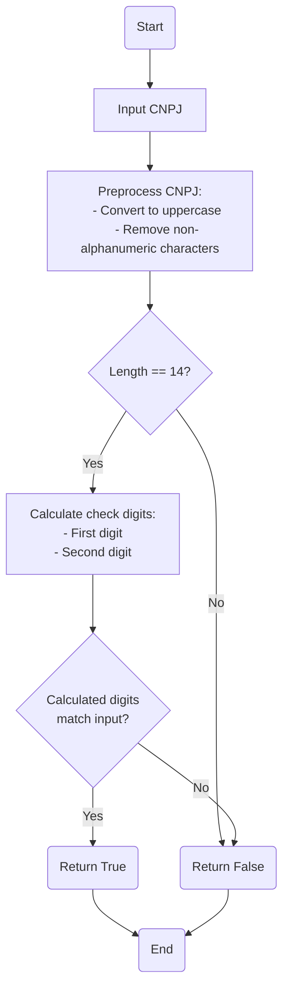

# CodigoUtil.java: CNPJ Validation Utility

## Scope and Purposes

CodigoUtil is a Java utility class designed to validate Brazilian CNPJ (Cadastro Nacional da Pessoa Jurídica) numbers. The class provides a static method `isValidCNPJ` that checks the validity of a given CNPJ string. 

The main functionalities of this utility include:

1. Preprocessing the input CNPJ string by removing non-alphanumeric characters and converting it to uppercase.
2. Verifying the length of the CNPJ (must be 14 digits).
3. Calculating and validating the two check digits of the CNPJ using the official algorithm.

This utility processes string data representing CNPJ numbers and returns a boolean value indicating whether the input is a valid CNPJ or not. It can be useful in applications that require validation of Brazilian company identification numbers, such as registration forms or data import processes.
## Process Flow




## Functional Overview

The CodigoUtil class provides a utility method for validating Brazilian CNPJ numbers. Its main functionality is the `isValidCNPJ` method, which takes a CNPJ string as input and returns a boolean indicating whether the CNPJ is valid or not.

Key insights:
- The method preprocesses the input to standardize the CNPJ format.
- It implements the official CNPJ validation algorithm, including check digit calculation.
- The validation is robust, handling various input formats and potential exceptions.

## Features Details

### Logic

1. Preprocess the input CNPJ:
   - Convert to uppercase
   - Remove all non-alphanumeric characters
2. Check if the preprocessed CNPJ has exactly 14 digits
3. Calculate the first check digit using the first 12 digits and a specific weight array
4. Calculate the second check digit using the first 13 digits (including the first check digit) and another weight array
5. Compare the calculated check digits with the last two digits of the input CNPJ
6. Return true if both check digits match, false otherwise

### Variables

- `cnpj`: Input CNPJ string
- `cnpjStr`: Preprocessed CNPJ string
- `weight1`: Integer array for calculating the first check digit
- `weight2`: Integer array for calculating the second check digit
- `sum`: Running sum for check digit calculations
- `mod`: Modulus result used in check digit calculations
- `firstDigit`: Calculated first check digit
- `secondDigit`: Calculated second check digit

### Data Structures

- `int[] weight1`: Array of integers used as weights for calculating the first check digit
- `int[] weight2`: Array of integers used as weights for calculating the second check digit

### Error Handling

1. Input length check:
   - If the preprocessed CNPJ doesn't have exactly 14 digits, the method returns false
2. Exception handling:
   - The main calculation is wrapped in a try-catch block
   - Any exception during the process (e.g., NumberFormatException) results in the method returning false
3. Invalid character handling:
   - The preprocessing step removes any non-alphanumeric characters, effectively handling inputs with unexpected formatting
## Dependencies (Optional)

This program does not have any external dependencies. It is a self-contained utility class that doesn't rely on external programs, classes, data structures, databases, APIs, files, or network connections.
## Involved Objects

- CodigoUtil: The main utility class containing the CNPJ validation logic.

There are no external objects, programs, or database tables involved in this code.
## Profiling Details

This program does not have any user-specific permissions or profiles. The CNPJ validation utility is designed to be used without any authentication or authorization requirements.

## Subroutines

### isValidCNPJ(String cnpj)

Purpose: Validates a given CNPJ number.

Parameters:
- `cnpj`: A String representing the CNPJ number to be validated.

Usage: Call this static method with a CNPJ string to check its validity.

Considerations:
- The input CNPJ can contain formatting characters (dots, slashes, hyphens) as they will be removed during preprocessing.
- The method is case-insensitive, so both uppercase and lowercase inputs are accepted.

## Unexpected Cases

Error handling in this program is primarily focused on input validation and exception catching:

1. Invalid input length: If the preprocessed CNPJ doesn't have exactly 14 digits, the method returns false.
2. Exception handling: Any exception during the validation process (e.g., NumberFormatException) is caught, and the method returns false.

There are no specific error codes or messages generated by this program. Instead, it uses a boolean return value to indicate validity:
- `true`: The input CNPJ is valid.
- `false`: The input CNPJ is invalid or an error occurred during validation.

The program does not include any specific concurrency handling or recovery mechanisms, as it's a stateless utility method.

## Testing and Validation

To test the CNPJ validation functionality, you can use the following test cases:

1. Valid CNPJ:
   Input: "12.345.678/0001-95"
   Expected Output: true

2. Valid CNPJ without formatting:
   Input: "12345678000195"
   Expected Output: true

3. Invalid CNPJ (wrong check digits):
   Input: "12.345.678/0001-96"
   Expected Output: false

4. Invalid CNPJ (incorrect length):
   Input: "123456780001"
   Expected Output: false

5. Invalid CNPJ (non-numeric characters):
   Input: "12.345.678/ABCD-95"
   Expected Output: false

To test the program:

1. Create an instance of the CodigoUtil class.
2. Call the `isValidCNPJ` method with different CNPJ strings.
3. Compare the returned boolean value with the expected output.

Example:


```java
CodigoUtil util = new CodigoUtil();
System.out.println(util.isValidCNPJ("12.345.678/0001-95")); // Should print: true
System.out.println(util.isValidCNPJ("12345678000196")); // Should print: false

```


You can also use the provided `main` method as a starting point for testing, replacing the example CNPJ with different test cases.
