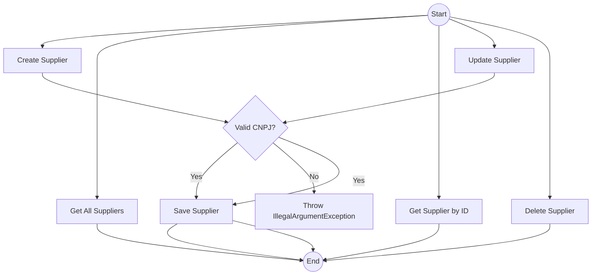
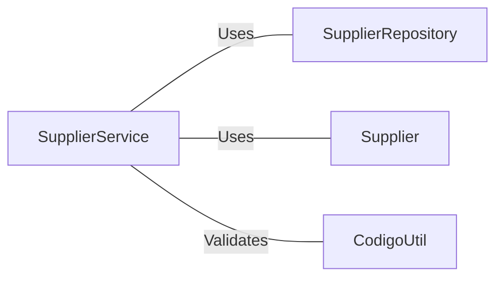

# SupplierService.java: Supplier Management Service

## Scope and Purposes

The SupplierService class is a Spring service component responsible for managing supplier-related operations in a supplier management system. It provides functionality for creating, retrieving, updating, and deleting supplier records. The service interacts with a SupplierRepository to perform database operations and utilizes a CodigoUtil class for CNPJ (Brazilian company identification number) validation.

Key functionalities include:

1. Creating new supplier records with CNPJ validation
2. Retrieving all suppliers or a specific supplier by ID
3. Updating existing supplier information
4. Deleting supplier records

The service processes Supplier objects, which likely contain fields such as ID, name, CNPJ, contact name, contact email, and contact phone number. It ensures data integrity by validating CNPJ numbers before creating or updating supplier records and handles exceptions for invalid inputs or when suppliers are not found.
## Process Flow

## Functional Overview

The SupplierService class provides a comprehensive set of operations for managing supplier data within a Spring-based application. It offers CRUD (Create, Read, Update, Delete) functionalities for supplier records, ensuring data integrity through CNPJ validation. The service acts as an intermediary between the application's business logic and the data persistence layer, abstracting database operations through the use of a SupplierRepository.

Key insights:
- The service emphasizes data validation, particularly for CNPJ, before persisting supplier information.
- It utilizes Spring's dependency injection for seamless integration with the repository layer.
- The service handles both single-record and bulk operations, providing flexibility in data retrieval.
- Exception handling is implemented to manage scenarios such as invalid input or missing records.

## Features Details

### Logic

1. Create Supplier:
   - Validates the CNPJ using CodigoUtil.
   - Throws an IllegalArgumentException if CNPJ is invalid.
   - Saves the supplier using the repository if validation passes.

2. Retrieve Suppliers:
   - Fetches all suppliers or a specific supplier by ID.
   - Uses Optional for handling potential null results when fetching by ID.

3. Update Supplier:
   - Validates the updated CNPJ.
   - Retrieves the existing supplier record.
   - Updates the supplier's information.
   - Saves the updated record.

4. Delete Supplier:
   - Verifies the supplier's existence before deletion.
   - Removes the supplier record from the repository.

### Variables

- `supplierRepository`: An instance of SupplierRepository used for database operations.
- `supplier`: Represents a Supplier entity in various methods.
- `supplierDetails`: Contains updated information for a supplier in the update method.
- `id`: Long value representing the unique identifier of a supplier.

### Data Structures

- `Supplier`: An entity class representing a supplier with fields such as id, nome (name), cnpj, nomeContato (contact name), emailContato (contact email), and telefoneContato (contact phone).
- `List<Supplier>`: Used to return multiple supplier records in the getAllSuppliers method.
- `Optional<Supplier>`: Wraps a potentially null Supplier object when retrieving by ID.

### Error Handling

1. CNPJ Validation:
   - Throws IllegalArgumentException with the message "Invalid CNPJ" if the CNPJ fails validation.

2. Supplier Not Found:
   - Throws RuntimeException with the message "Supplier not found with id [id]" when attempting to update or delete a non-existent supplier.

3. Optional Handling:
   - Uses Optional to handle potential null results when retrieving a supplier by ID, allowing for graceful handling of missing records.
## Dependencies

- `SupplierRepository`: Interacts with the database to perform CRUD operations on Supplier entities. The service uses this repository for all database-related operations.

- `Supplier`: Data structure representing a supplier entity. The service processes and manages Supplier objects, including creating, updating, and retrieving supplier information.

- `CodigoUtil`: Utility class used for validating CNPJ (Brazilian company identification number). The service calls the `isValidCNPJ` method to ensure the validity of CNPJ before creating or updating supplier records.
## Involved Objects

- SupplierService: Main service class handling supplier-related operations.
- SupplierRepository: Repository interface for database operations on Supplier entities.
- Supplier: Entity class representing a supplier.
- CodigoUtil: Utility class for CNPJ validation.

External objects:
- None explicitly mentioned in the provided code.

## Data Manipulation (SQL)

While there are no explicit SQL statements in the code, the SupplierRepository likely generates SQL queries based on the following operations:

- `supplierRepository.save(supplier)`: Generates an INSERT or UPDATE SQL statement to persist supplier data.
- `supplierRepository.findAll()`: Generates a SELECT SQL statement to retrieve all suppliers.
- `supplierRepository.findById(id)`: Generates a SELECT SQL statement to retrieve a specific supplier by ID.
- `supplierRepository.deleteById(id)`: Generates a DELETE SQL statement to remove a supplier by ID.

Table structure (inferred from Supplier entity):

| Attribute       | Type   | Description                            |
|-----------------|--------|----------------------------------------|
| id              | Long   | Unique identifier for the supplier     |
| nome            | String | Name of the supplier                   |
| cnpj            | String | CNPJ (Brazilian company ID) of supplier|
| nomeContato     | String | Name of the contact person             |
| emailContato    | String | Email of the contact person            |
| telefoneContato | String | Phone number of the contact person     |
## Profiling Details

The SupplierService class does not explicitly implement user permissions or profiles. However, as it's a Spring service, it could be integrated with Spring Security to enforce access control based on user roles. For example:

- Admin users might have access to all methods (create, read, update, delete).
- Regular users might only have access to read methods (getAllSuppliers, getSupplierById).
- Specific roles might be required for update and delete operations.

## Subroutines

1. createSupplier(Supplier supplier)
   - Purpose: Creates a new supplier record
   - Parameters: Supplier object containing supplier details
   - Usage: Validates CNPJ before saving
   - Considerations: Ensure CNPJ is provided and in the correct format

2. getAllSuppliers()
   - Purpose: Retrieves all supplier records
   - Parameters: None
   - Usage: Returns a List of all Supplier objects
   - Considerations: May need pagination for large datasets

3. getSupplierById(Long id)
   - Purpose: Retrieves a specific supplier by ID
   - Parameters: Long id of the supplier
   - Usage: Returns an Optional<Supplier>
   - Considerations: Handle cases where supplier might not exist

4. updateSupplier(Long id, Supplier supplierDetails)
   - Purpose: Updates an existing supplier record
   - Parameters: Long id of the supplier, Supplier object with updated details
   - Usage: Validates CNPJ, retrieves existing supplier, updates fields, and saves
   - Considerations: Ensure all required fields are provided in supplierDetails

5. deleteSupplier(Long id)
   - Purpose: Deletes a supplier record
   - Parameters: Long id of the supplier to delete
   - Usage: Verifies supplier existence before deletion
   - Considerations: Handle potential cascading deletes if there are related records

## Unexpected Cases

1. Error Handling:
   - IllegalArgumentException: Thrown when an invalid CNPJ is provided
   - RuntimeException: Thrown when a supplier is not found for update or delete operations
   - Potential database exceptions are not explicitly handled in this service

2. Concurrency:
   - No explicit concurrency handling is implemented in this service
   - Consider using @Transactional annotations for database operations to ensure atomicity

3. Error Messages:
   - "Invalid CNPJ": Indicates the provided CNPJ failed validation
   - "Supplier not found with id [id]": Indicates attempt to update or delete a non-existent supplier

4. Error Reporting:
   - Exceptions are thrown but not caught within the service
   - Implement a global exception handler at the controller level to manage these exceptions and provide appropriate HTTP responses

## Testing and Validation

Test cases should cover the following scenarios:

1. Create Supplier:
   - Input: Valid Supplier object with correct CNPJ
   - Expected Output: Saved Supplier object with assigned ID
   - Input: Supplier object with invalid CNPJ
   - Expected Output: IllegalArgumentException

2. Get All Suppliers:
   - Input: None
   - Expected Output: List of all Supplier objects in the database

3. Get Supplier by ID:
   - Input: Existing supplier ID
   - Expected Output: Optional containing the Supplier object
   - Input: Non-existent supplier ID
   - Expected Output: Empty Optional

4. Update Supplier:
   - Input: Existing supplier ID and valid Supplier object with updated details
   - Expected Output: Updated Supplier object
   - Input: Non-existent supplier ID
   - Expected Output: RuntimeException
   - Input: Existing supplier ID and Supplier object with invalid CNPJ
   - Expected Output: IllegalArgumentException

5. Delete Supplier:
   - Input: Existing supplier ID
   - Expected Output: true (indicating successful deletion)
   - Input: Non-existent supplier ID
   - Expected Output: RuntimeException

To test the program:
1. Set up a test database or use an in-memory database like H2
2. Create mock objects for SupplierRepository and CodigoUtil
3. Use a testing framework like JUnit to write and run test cases
4. Implement integration tests to verify the interaction with the database
5. Use tools like Mockito to mock dependencies and isolate the service for unit testing
